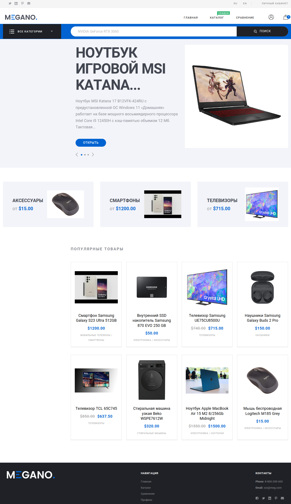

# Интернет-магазин MEGANO
***

## Структура проекта
### Приложения
- account - личный кабинет, пользователи и продавцы
- adminsettings - административные настройки сайта 
- cart - добавление товаров в корзину и создание заказов
- catalog - каталог и отзывы
- discounts - применение скидок к товарам
- payments - сервис оплаты заказов
- products - товары, категории, характеристики


### Служебные файлы и дерриктории
- fixtures - фикстуры с тестовыми данными
- locale - локализация текстовых строк
- media - загружамые медиа-файлы
- static - статические файлы для веб-приложения
- templates - шаблоны веб-страниц
- .env.template - шаблон переменных окружения
- docker-compose.dev.yaml - настройки docker-compose для разработки
- docker-compose.yaml - настройки docker-compose для продакшн
- docker-entrypoint.sh - скрипт запуска контейнера Docker
- Dockerfile - описание образа Docker
- nginx.conf - конфигурация Nginx
- requirements.txt - зависимости Python

***

## Установка и запуск проекта

Склонировать проект:

```
git clone https://gitlab.skillbox.ru/pythondjango_team37/diplom.git
```
В репозитории хранится файл .env.template. Надо на его основе создать и заполнить файл .env 

Если необходимо загрузить тестовые данные, то в файле .env требуется указать:
```
load_test_data=True
```
При загрузке тестовых данных создается пять пользователей:

| E-mail                   | Пароль    | Категория     |
|--------------------------|-----------|---------------|
| admin@megano.com         | 123       | superuser     |
| seller_tony@megano.com   | qwaszx11  | Продавец      |
| seller_erlich@megano.com | qwaszx11  | Продавец      |
| manager@megano.com       | qwaszx11  | Администратор |
| walter@megano.com        | qwaszx11  | Покупатель    |
***
### Для работы сервиса оплаты необходимо:
- Войти/зарегестрироваться на сервисе "ЮКасса" по ссылке
```
https://yookassa.ru/yooid/signin/step/login?origin=Checkout&returnUrl=https%3A%2F%2Fyookassa.ru%2Fmy%2Fprofile
```
- Создать свой интернет магазин, сдедуя инструкциям ЮКассы
- Перейти по ссылке
```
https://yookassa.ru/my/shop-settings
```
- Из поля "shopId" скопировать id своего магазана
- Перейти по ссылке
```
https://yookassa.ru/my/merchant/integration/api-keys
```
- Из поля "Секретный ключ" скопировать секретный ключ своего магазина
- Перейти по ссылке
```
https://yookassa.ru/my/merchant/integration/http-notifications
```
- Если выключены какие-либо уведомления - включить
- В поле "URL для уведомлений" ввести, где "example.com" пример доменного имени. 
```
https://example.com/payment/notification_url/
```
- В файл .env добавить скопированные "shopId" и "Секретный ключ" в соответсвующие поля
***
Перед запуском проекта необходимо собрать контейнер командой:
```
docker compose build
```

Запуск проекта: 
```
docker compose up -d
```
***
